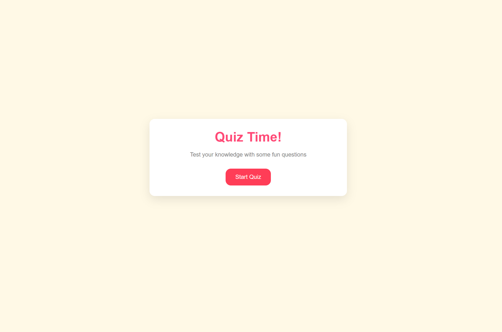
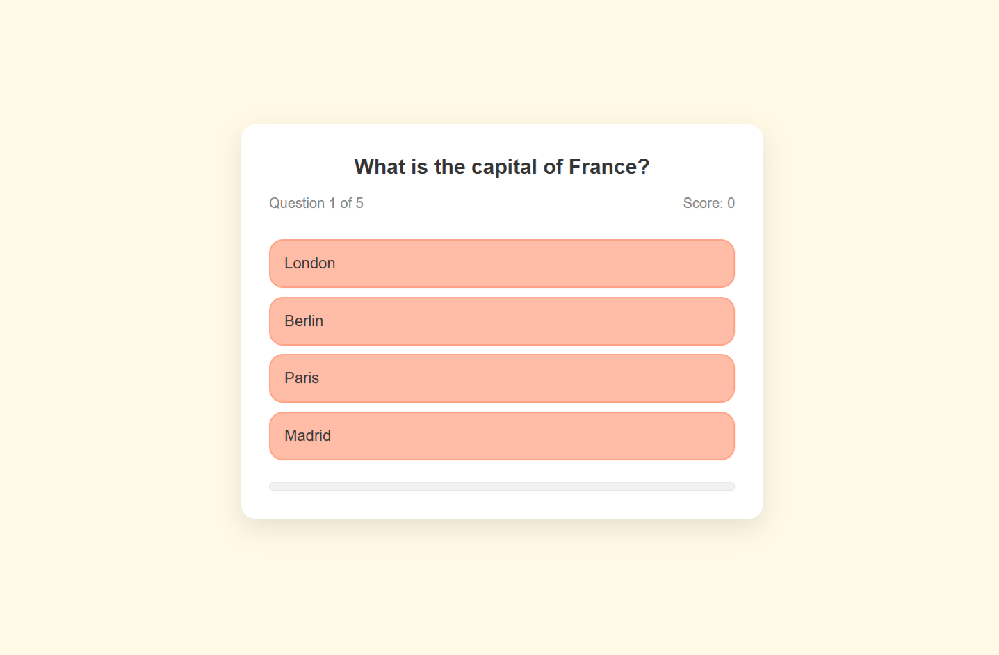
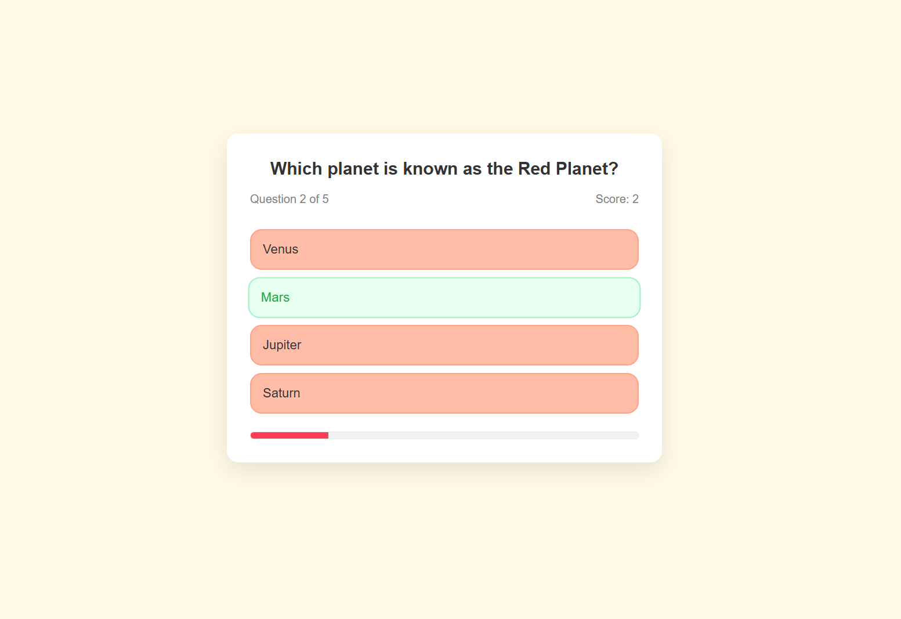
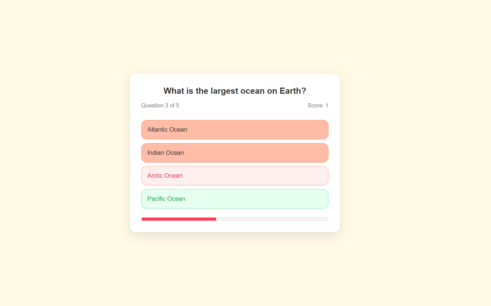
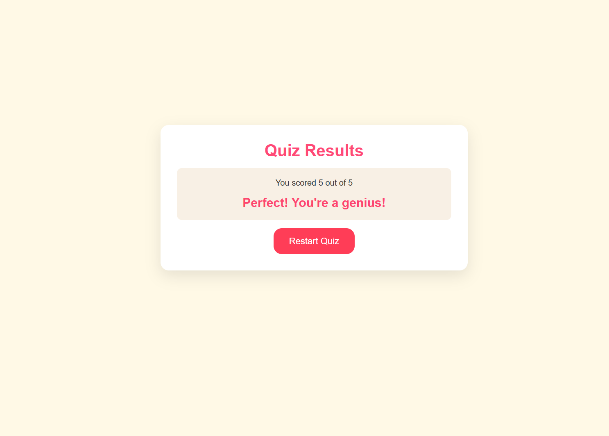

# 🧠 Quiz Game

A fun, interactive quiz game built with **HTML**, **CSS**, and **JavaScript**.  
Test your knowledge across multiple questions and get instant feedback on each answer with score tracking and animated progress updates.

---

## 🌐 Live Preview

👉 [Quiz-Game Demo](https://quiz-game-xo1.netlify.app/)

---

## 🖼️ Preview

|                Start Screen                 |               Quiz Screen               |              Correct Answer               |             Wrong Answer              |               Result Screen                |
| :-----------------------------------------: | :-------------------------------------: | :---------------------------------------: | :-----------------------------------: | :----------------------------------------: |
|  |  |  |  |  |

---

## 📁 File Overview

Quiz Game/
│
├── index.html # Main quiz structure
├── CSS/
│ └── style.css # Styling and layout
├── JavaScript/
│ └── script.js # Game logic and quiz flow control
└── Image/ # Preview Images
│ └──1startingscreen.png
│ └──2quizpreview.png
│ └──3correctans.png
│ └──4wrongans.png
│ └──5resultscreen.png
└── Readme.md # README File
│

---

## 🧩 Features

- 🧠 Interactive quiz system with multiple questions
- ✅ Real-time answer validation (correct/wrong highlighting)
- 📊 Progress bar updates dynamically per question
- 💯 Score tracking with instant results
- 🔁 Restart option for replay
- 🖥️ Fully responsive clean UI

---

## 🛠️ Tech Used

- **HTML5** – Page structure
- **CSS3** – Styling, layout & transitions
- **JavaScript (ES6)** – Core logic, DOM handling & game control

---
